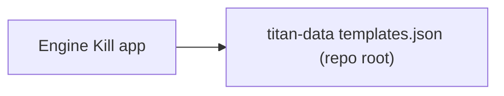

# Single-source `templates.json` — refactor (complete)

**Status:** **Closed.** The refactor (single `templates.json` load, titan-data as source of truth) is done. This doc stays as a **retrospective** and **app follow-ups** (banners); **`templates.json`** gaps and proofreading live in [`DATA_AUDIT.md`](./DATA_AUDIT.md).

**Outcome:** Engine Kill loads **one file** from titan-data: **`templates.json`** at the repo root (`{baseUrl}templates.json`). No runtime BattleScribe XML, no merge/override fetch, no adapter on the app path. Reference game data that used to live in scattered templates / BS-driven paths now lives in **titan-data** as that single JSON artifact (with `.gst`/`.cat` there for data-entry reference only).

**Agent / data context:** **[`docs/AGENT_DATA_CONTEXT.md`](./AGENT_DATA_CONTEXT.md)**

**BattleScribe ↔ JSON audit:** **[`docs/DATA_AUDIT.md`](./DATA_AUDIT.md)** — recorded gaps and follow-ups; **editing `templates.json` against that doc is normal maintenance**, not an open “refactor step.”

**Conventions:** **[`docs/DATA_PATTERNS.md`](./DATA_PATTERNS.md)**

**Tests:** **[`docs/TESTING_TEMPLATES.md`](./TESTING_TEMPLATES.md)** · `npm test` · `npm run test:e2e`

**titan-data:** **[`ENGINE_KILL_TEMPLATES.md`](https://github.com/SCPublic/titan-data/blob/master/ENGINE_KILL_TEMPLATES.md)**

---

## Refactor checklist (retrospective)

| # | Status | Item |
|---|--------|------|
| 1–10 | **Done** | Single `templates.json` load, `templatesLoader` / `templatesCache`, no runtime adapter, renames, titan-data root artifact, docs. |
| 11 | **Done** | **Data audit** recorded in [`DATA_AUDIT.md`](./DATA_AUDIT.md) (chunks 0, L, M, T, B, U, P pilot, X pilot). Optional deeper passes remain *optional* (see that doc: §T legio visibility / slug arms, P full trait diff, X sweeps). |
| — | **Done (refactor scope)** | **Authoritative data in titan-data:** runtime and editing workflow center on root **`templates.json`**; BS files support catalog-aligned entry, not app loading. |

---

## After the refactor (backlog elsewhere)

- **Priority backlog:** **[`docs/TODO.md`](./TODO.md)** — audit remediation (ordered), ungroomed items from CONCERNS/elsewhere, groomed knight/banner track.
- **`templates.json` content:** Placeholder weapons, ion tables, Legio Crusade row, banner fill-in, etc. — detail in **[`DATA_AUDIT.md`](./DATA_AUDIT.md)**; knight/banner work in **TODO.md** §1, full audit backlog **§2**.
- **Engine Kill UX:** e.g. fixed-loadout banners — **[§ App & UX follow-ups (banners)](#app--ux-follow-ups-banners)** below; banner-related execution in **TODO.md** §1; other backlog **§3**.

---

## App & UX follow-ups (banners)

**Fixed-loadout banners still allow “editing” arms in UI**

- **Issue:** Banners with `fixedBannerArmWeaponIds` have a **data-defined** loadout per model (two arms, or three systems e.g. Asterius). The app still exposes Banner composition **+/-** and **“EDIT BANNER LOADOUT”** in places, which implies mutable weapons.
- **Files:** `src/screens/HomeScreen.tsx`, `src/screens/UnitEditScreen.tsx`. Schema: `src/models/UnitTemplate.ts` (`fixedBannerArmWeaponIds`).
- **Fix approach:** When `fixedBannerArmWeaponIds` is set (`length >= 2`), hide or disable per-weapon pickers; read-only copy; keep `bannerWeaponIds` in sync via `unitService.bannerArmWeaponIdsForKnightCount` (supports 2- and 3-weapon fixed lists).

---

## Runtime flow

---

## Supersedes

Earlier migration plans are superseded by runtime **`templates.json`** only. Historical one-off docs were removed; see **[`AGENT_DATA_CONTEXT.md`](./AGENT_DATA_CONTEXT.md)** §Historical.
